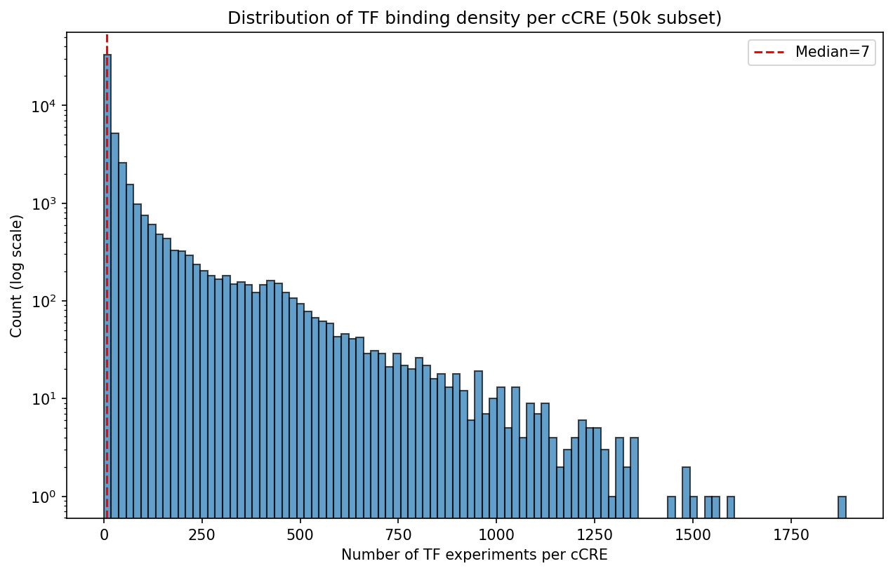
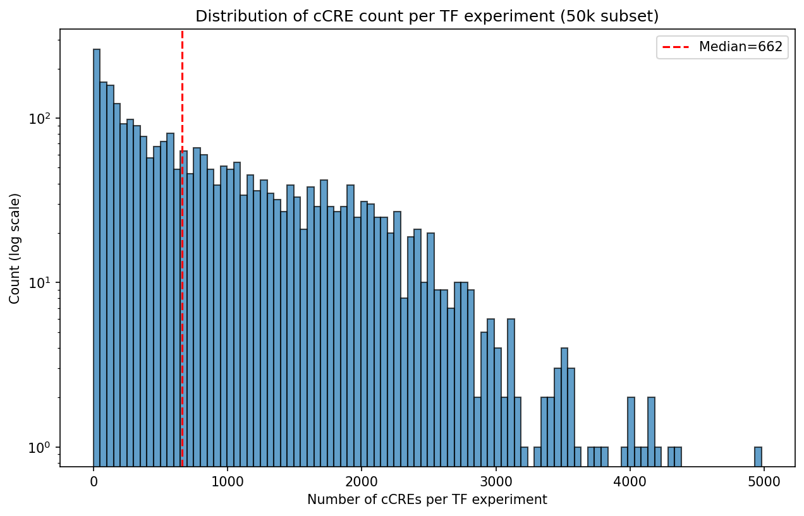
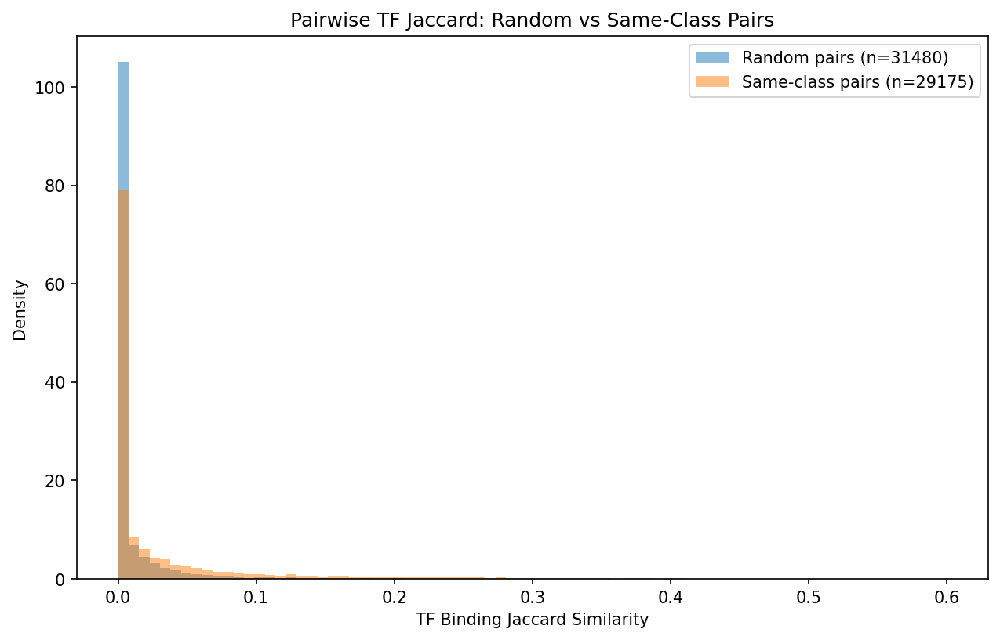
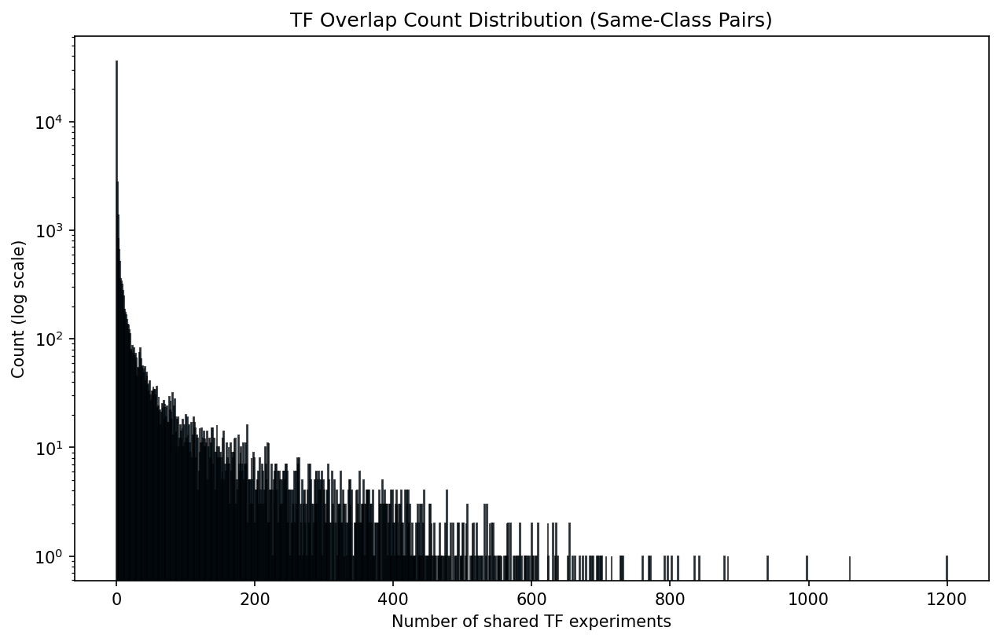
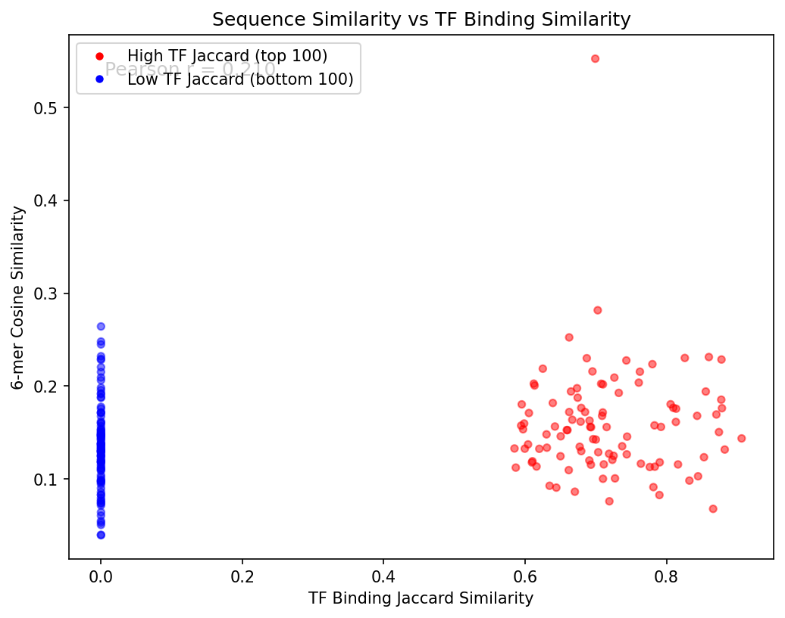
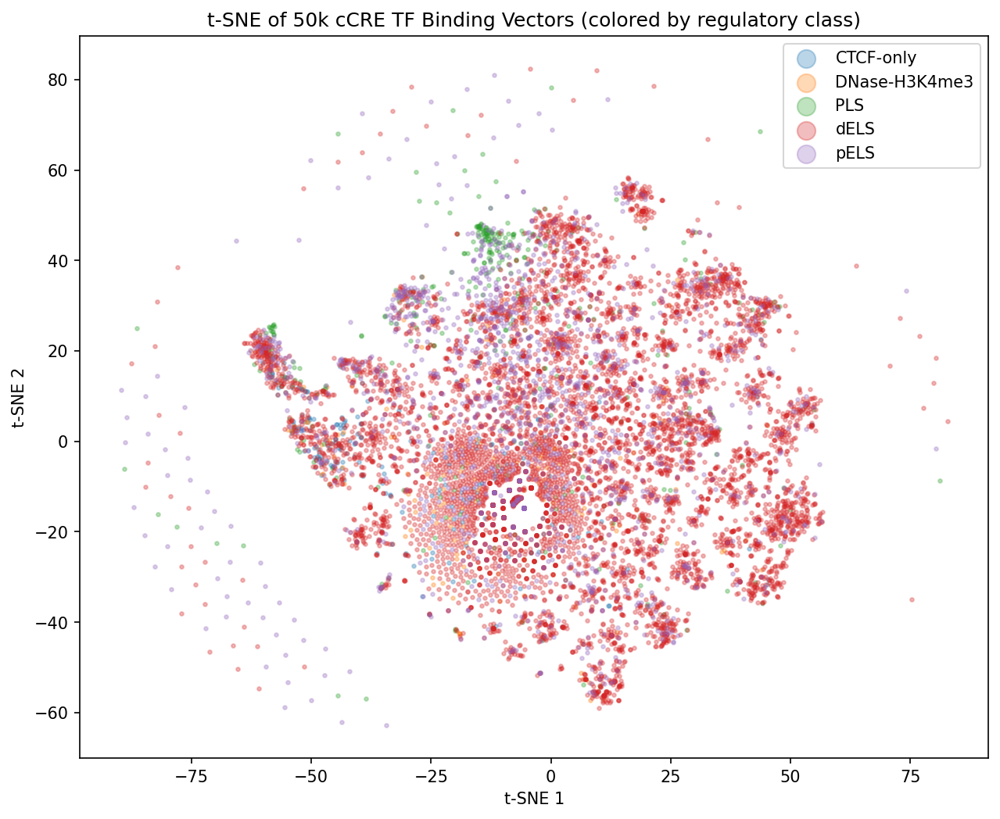
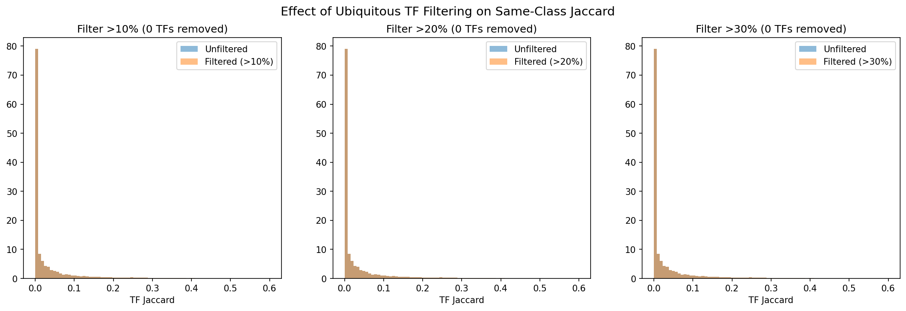

# Late-Interaction Retrieval of Regulatory DNA Sequences Using ColBERT and DNABERT-2

## 1. Introduction

The human genome contains approximately one million regulatory "switches" called candidate cis-regulatory elements (cCREs) — promoters, enhancers, and insulators that control when and where genes are turned on. The ENCODE SCREEN registry has cataloged these elements and classified them by epigenomic signatures, but finding functionally similar elements given only a raw DNA sequence remains an open retrieval problem.

This project asks: **can a ColBERT-style late-interaction retrieval model, built on a pretrained DNA language model, recover biologically similar regulatory elements better than simpler baselines?**

### 1.1 Problem Statement

The sole input to our model is the raw nucleotide sequence — a string of A, T, G, C characters, approximately 512 characters long. No metadata, no annotations, no hand-engineered features. The model must learn, from sequence alone, which character patterns predict shared regulatory function. If it can, this demonstrates that DNA sequence contains sufficient information to recover biological similarity — and that a learned retrieval model can extract this signal better than simple string-matching approaches.

### 1.2 Why Late Interaction

Regulatory elements are modular — their function arises from combinations of short transcription factor (TF) binding motifs (6–20 bp) embedded in longer sequences (200–1000+ bp). Two enhancers may be functionally similar because they share three out of five binding sites, even if those sites appear at different positions and the intervening sequence is unrelated.

ColBERT's MaxSim scoring is a natural fit:
- **Token embeddings** capture local sequence context at each position
- **MaxSim** finds the best-matching position in the document for each query token, tolerating positional variation
- **Summation** aggregates evidence across all query positions, rewarding partial motif overlap without requiring global alignment

Mean pooling, by contrast, compresses the full sequence into a single vector, making it difficult to distinguish "shares 3 of 5 motifs" from "shares 0 of 5 motifs but has similar base composition."

## 2. Dataset

### 2.1 Source: ENCODE SCREEN Registry

We use cCREs from the ENCODE SCREEN V3 registry (GRCh38), which catalogs 1,063,878 human cCREs classified into 5 regulatory classes based on combinations of histone marks and chromatin accessibility:

| Class | Full Name | Description | Registry Count |
|-------|-----------|-------------|---------------|
| PLS | Promoter-like signature | Near gene starts, high H3K4me3 | ~40k |
| pELS | Proximal enhancer-like | Near genes, high H3K27ac | ~120k |
| dELS | Distal enhancer-like | Far from genes, high H3K27ac | ~790k |
| CTCF-only | CTCF-bound only | Only CTCF signal, no histone marks | ~80k |
| DNase-H3K4me3 | DNase with H3K4me3 | Open chromatin + H3K4me3 | ~30k |

For our experiments, we use a 50,000-element subset with chromosome-held-out splits (val: chr2/chr10, test: chr1/chr8/chr21) to prevent data leakage from linked regulatory elements on the same chromosome.

### 2.2 Similarity Signal: TF Binding Profiles

Defining "biologically similar" is the central challenge. We explored two approaches:

**Initial approach: class-derived proxy (6 dimensions).** We encoded the 5 class labels plus CTCF-binding status as a 6-dimensional binary vector. This proved insufficient — with only 6 dimensions, same-class elements almost always exceeded the positive threshold, reducing the task to a trivial 5-way classification. Training with this signal produced models that converged to the random baseline (val MRR ≈ 0.05 across 10 epochs).

**Enrichment: ENCODE TF ChIP-seq binding profiles (2,818 dimensions).** We integrated the ENCODE TF peaks matrix (ENCFF257UKO), which records for each cCRE which of 2,818 transcription factor ChIP-seq experiments show a binding peak. The result is a 2,818-dimensional binary vector per cCRE.

### 2.3 Exploratory Data Analysis

We conducted a comprehensive analysis of the TF binding vectors across the 50k subset to understand the data distribution and inform threshold selection.

**TF binding density per cCRE.** The distribution is heavily right-skewed with a median of 7 TF experiments per cCRE and a long tail extending to ~1,889. Critically, **20.6% of cCREs (10,301 elements) have zero TF peaks**, meaning they cannot participate meaningfully in TF-supervised training.

**TF experiment coverage.** Each TF experiment covers a variable number of cCREs. The top experiments (ZNF687, CTCF, POLR2A) each bind ~4,000–5,000 elements (~8–10% of the subset), but no single experiment exceeds 10%, so there are no truly "ubiquitous" TFs to filter.

**Pairwise Jaccard distributions.** The Jaccard similarity between TF binding vectors is extremely sparse. For random pairs, the median Jaccard is 0.000 (mean 0.010). For same-class pairs, the median is still 0.000 (mean 0.038), with only the 95th percentile reaching 0.21. This means most same-class elements share almost no TF binding — the signal is concentrated in a small fraction of pairs.

**Overlap count analysis.** Among same-class pairs, 22.2% share ≥ 2 TF experiments, but the overlap = 2 pairs are dominated by housekeeping TFs: CTCF (28%), POLR2A/POLR2AphosphoS5 (35%), and MAX. These are regulatory machinery common to many elements and do not indicate functional similarity.

**Positive yield at various thresholds:**

| Threshold | Median positives/query | Queries with 0 positives | Queries with ≥ 4 positives |
|-----------|----------------------|-------------------------|---------------------------|
| Jaccard ≥ 0.3 | 0 | 71.3% | 9.2% |
| Jaccard ≥ 0.5 | 0 | 89.1% | 2.6% |
| Overlap ≥ 2 | 43 | 14.5% | 80.9% |
| Overlap ≥ 3 | 27 | 22.8% | 71.7% |
| Overlap ≥ 5 | 12 | 35.3% | 59.0% |

This reveals a fundamental tension: strict Jaccard thresholds (≥ 0.5) produce almost no positives, while lenient overlap thresholds (≥ 2) produce positives dominated by housekeeping TF co-occurrence.

**k-mer vs TF Jaccard correlation.** To validate that TF binding similarity is recoverable from sequence, we compared 6-mer cosine similarity against TF Jaccard for the 100 highest and 100 lowest Jaccard same-class pairs (requiring ≥ 5 TFs each). Pearson r = 0.21 — a weak but nonzero correlation. High-TF-Jaccard pairs have slightly higher k-mer similarity (0.159 vs 0.136), suggesting there is sequence signal, but it is subtle.

**t-SNE of TF binding vectors by class.** A t-SNE projection (10k subsample) of the 2,818-dim TF vectors colored by regulatory class shows that dELS (dominant class) exhibits clear internal substructure — multiple distinct clusters corresponding to different regulatory programs. PLS and CTCF-only form identifiable clusters. This confirms there is within-class structure in the TF binding data that a model could potentially learn.

**Ubiquitous TF filtering.** We tested removing TF experiments binding > 10%, 20%, or 30% of cCREs. No experiments exceeded even the 10% threshold, so ubiquitous TF filtering is unnecessary for this dataset.

### 2.4 Limitations of the SCREEN/TF Dataset

The EDA reveals several challenges with using SCREEN cCREs + TF binding as a retrieval benchmark:

1. **Sparsity.** 20.6% of cCREs have zero TF peaks, and the median is only 7 out of 2,818 experiments. Most pairwise Jaccard values are zero.
2. **Experimental bias.** TF binding is measured in specific cell lines (HepG2, K562, etc.), not universally. Low Jaccard between two enhancers may mean "different function" or simply "tested in different labs."
3. **Weak sequence-function correlation.** Pearson r = 0.21 between k-mer similarity and TF Jaccard suggests the sequence signal exists but is subtle — the model needs to learn complex motif grammar, not just composition.
4. **Threshold sensitivity.** No threshold cleanly separates meaningful positives from noise. Strict thresholds starve the training of positives; lenient thresholds admit housekeeping TF noise.

These limitations motivate our planned transition to the DeepSEA dataset (see Section 6).

## 3. Model Architecture

### 3.1 Backbone: DNABERT-2

We use DNABERT-2 (117M parameters), a BERT-based DNA language model pretrained on multi-species genomes with Byte Pair Encoding (BPE) tokenization. Key specifications:
- **Hidden dimension:** 768
- **Layers:** 12 transformer layers
- **Attention heads:** 12
- **Vocabulary:** 4,096 BPE tokens
- **Max sequence length:** 512 tokens

### 3.2 ColBERT Late-Interaction Scoring

The ColBERT architecture adds a learned linear projection from the backbone's 768-dim hidden states to 64-dim normalized token embeddings. Scoring follows the standard ColBERT MaxSim formulation:

$$\text{score}(Q, D) = \sum_{i=1}^{m} \max_{j=1}^{n} (q_i \cdot d_j) \cdot \mathbb{1}[q_i \text{ not padding}]$$

### 3.3 Fine-Tuning with LoRA

Rather than full fine-tuning, we apply Low-Rank Adaptation (LoRA) to the backbone's query/key/value projections (`Wqkv`) and dense layers, with rank 16, alpha 32, and dropout 0.1. This reduces trainable parameters from 117M to ~2M while preserving pretrained representations.

### 3.4 Training Objective

Multi-positive softmax (InfoNCE) loss with temperature τ = 0.1:

$$\mathcal{L} = -\frac{1}{|B|} \sum_{i \in B} \left[ \log \frac{\sum_{j \in P_i} \exp(s_{ij} / \tau)}{\sum_{k=1}^{N} \exp(s_{ik} / \tau)} \right]$$

We use gradient accumulation (4 steps) to stabilize optimization, giving an effective batch of 80 queries per weight update.

## 4. Baselines

Each baseline answers a specific question about the retrieval system, ordered from confound checks to architectural comparisons.

### 4.1 Nuisance Baselines

**Random.** Documents scored with uniform random values. Establishes the absolute floor.

**GC-matched random.** Documents in the same GC-content decile as the query are scored randomly; others receive -inf. Tests whether retrieval metrics are inflated by GC-content confounds.

### 4.2 Alignment-Free Sequence Baselines

**K-mer cosine (k=6).** 6-mer frequency vectors (4,096 dimensions) scored by cosine similarity. The standard "cheap but serious" baseline for DNA similarity.

**TF-IDF k-mer.** Same 6-mer vectors, but weighted by inverse document frequency across the corpus. Downweights common k-mers (poly-A runs) and upweights rare, potentially motif-relevant k-mers.

**MinHash k-mer Jaccard.** Approximate Jaccard similarity over k-mer sets using MinHash signatures (128 hash functions). Unlike cosine, this measures set overlap (presence/absence) rather than frequency similarity.

**Gapped k-mer (gkm-SVM).** Enumerates gapped k-mers (k=10, l=6 informative positions, C(10,6)=210 patterns per window) that capture motif-like patterns with variable internal spacing — e.g., "GATA...GATA" with wildcard positions. Scored by cosine similarity in gapped k-mer feature space. This is a standard baseline in regulatory sequence analysis.

### 4.3 Neural Baselines

**Pretrained DNABERT-2 (mean-pooled, no fine-tuning).** Raw pretrained DNABERT-2 (117M params) with mean-pooled token embeddings projected to 768-dim vectors, scored by cosine similarity. No task-specific training. Tests whether generic DNA language model representations already capture regulatory similarity.

**Single-vector fine-tuned (mean-pooled).** Same DNABERT-2 backbone with LoRA, same contrastive training pairs and hyperparameters as ColBERT, but using mean-pooled cosine similarity instead of MaxSim. This is the **critical architectural baseline** — it isolates whether late interaction (token-level matching) adds value over single-vector compression. *(Training in progress.)*

### 4.4 Upper Bound

**Oracle (TF vector cosine).** Documents scored by cosine similarity on their true 2,818-dim TF binding vectors. No sequence information used. This is the theoretical ceiling — the best any method could do if it perfectly predicted TF binding from sequence.

## 5. Results

### 5.1 Evaluation Setup

- **Queries:** 512 test-split cCREs (sampled from chr1/chr8/chr21)
- **Corpus:** 2,048 test-split cCREs
- **Relevance labels:** Positive pairs from the TF-enriched pair construction pipeline
- **Activity vectors:** 2,818-dim TF binding vectors from ENCODE

### 5.2 Retrieval Metrics

| Metric | Random | GC-matched | K-mer | TF-IDF K-mer | MinHash | gkm-SVM | Pretrained DNABERT-2 | Oracle |
|--------|--------|------------|-------|-------------|---------|---------|---------------------|--------|
| **MRR** | 0.0054 | 0.0055 | 0.0074 | 0.0062 | 0.0082 | 0.0063 | **0.0093** | 0.0317 |
| **nDCG** | 0.0033 | 0.0038 | 0.0056 | 0.0058 | 0.0050 | 0.0058 | **0.0071** | 0.0261 |
| Recall@5 | 0.0010 | 0.0005 | 0.0020 | 0.0015 | 0.0020 | 0.0015 | **0.0024** | 0.0073 |
| Recall@10 | 0.0010 | 0.0020 | 0.0034 | 0.0024 | 0.0024 | 0.0024 | **0.0039** | 0.0176 |
| Recall@50 | 0.0073 | 0.0088 | 0.0127 | 0.0146 | 0.0103 | 0.0151 | **0.0161** | 0.0562 |

### 5.3 Biological Quality Metrics

| Metric | Random | GC-matched | K-mer | TF-IDF K-mer | MinHash | gkm-SVM | Pretrained DNABERT-2 | Oracle |
|--------|--------|------------|-------|-------------|---------|---------|---------------------|--------|
| Class purity@10 | 0.687 | 0.590 | 0.621 | 0.624 | 0.624 | 0.622 | **0.645** | 0.637 |
| Activity Jaccard@10 | 0.006 | 0.008 | 0.012 | 0.012 | 0.010 | 0.011 | 0.011 | **0.167** |

### 5.4 Analysis

**GC-matched random barely improves over random** (MRR 0.0055 vs 0.0054), confirming that our retrieval signal is not driven by GC-content confounds.

**Pretrained DNABERT-2 is the best sequence-based method**, beating all classical baselines without any task-specific training. MRR is 25% higher than k-mer cosine (0.0093 vs 0.0074) and 14% higher than MinHash (0.0093 vs 0.0082). This demonstrates that pretrained DNA language model representations capture regulatory patterns beyond what k-mer counting can express.

**Classical baselines perform similarly to each other.** K-mer cosine (0.0074), TF-IDF k-mer (0.0062), MinHash (0.0082), and gkm-SVM (0.0063) all cluster in the MRR 0.006–0.008 range. Notably, gkm-SVM (designed for regulatory DNA) does not outperform simple k-mer cosine on this task, suggesting the gapped k-mer patterns don't capture additional TF-binding-relevant signal on this dataset.

**TF-IDF weighting does not help over raw k-mer cosine** (MRR 0.0062 vs 0.0074). IDF downweighting of common k-mers removes some of the composition signal that simple cosine exploits.

**The oracle ceiling is distant.** Oracle MRR (0.0317) is 3.4× the best sequence-based method, and oracle Activity Jaccard@10 (0.167) is 14× higher. This confirms there is substantial headroom — a perfect TF binding predictor would dramatically improve retrieval — but also indicates the sequence → TF binding mapping is inherently lossy.

**All methods show low absolute performance.** Recall@50 below 2% for all sequence methods reflects the fundamental sparsity of the TF binding labels: most same-class pairs share zero TFs, making the relevance labels extremely sparse relative to corpus size.

### 5.5 Training Dynamics Observations

We attempted fine-tuning with contrastive learning (InfoNCE loss) under several configurations:

| Configuration | Result |
|--------------|--------|
| τ = 0.05, grad_accum = 1, 6-dim activity | Loss stagnates at random baseline (~4.9) after epoch 1 |
| τ = 0.1, grad_accum = 1, 6-dim activity | Loss decreases smoothly but val MRR flat at ~0.05 across 10 epochs |
| τ = 0.1, grad_accum = 1, TF 2818-dim | Same stagnation pattern — epoch 2 flattens at ~4.88 |
| τ = 0.1, grad_accum = 4, TF 2818-dim | Train loss breaks through to 1.68, but val loss stays at 4.90 (overfitting) |

The consistent pattern: the model learns to memorize training pairs (train loss drops well below random) but fails to generalize to held-out data. This overfitting suggests the TF binding signal is too sparse and noisy to provide clean supervision for sequence-level representation learning on this dataset.

## 6. Future Plans

### 6.1 Switch to DeepSEA Dataset

The primary limitation of our current approach is the similarity signal, not the model architecture. The ENCODE TF binding matrix is sparse (median 7 of 2,818 experiments per cCRE), experimentally biased (coverage depends on which cell lines were assayed), and weakly correlated with sequence features (r = 0.21).

The **DeepSEA** dataset provides a cleaner alternative:
- **919 binary chromatin features** per 1kb genomic sequence (TF binding, DNase hypersensitivity, histone marks across cell types)
- **Labels derived from uniform genome-wide assays** rather than heterogeneous experiment-specific peaks
- **Established benchmark** with known baselines, enabling direct comparison with published methods
- **Denser labels** — each sequence has predictions across all 919 features, eliminating the sparsity problem

With DeepSEA labels, we can define similarity as cosine similarity over the 919-dim chromatin feature vector — a much denser and more uniform signal than TF binding Jaccard.

### 6.2 Regulatory Program Discovery

Rather than using raw pairwise similarity, we plan to discover latent regulatory programs via NMF or k-means clustering on the chromatin feature matrix. Each cluster represents a co-occurring set of regulatory marks (e.g., an erythroid program, a neural program). The retrieval task then becomes: given a query sequence, retrieve elements belonging to the same regulatory program. This provides:
- Cleaner positive/negative labels (same program vs different program)
- Biologically interpretable clusters
- A testable claim: "sequence alone predicts regulatory program membership"

### 6.3 Architecture Improvements

- **ColBERT vs mean-pooled comparison.** Our pretrained baseline used mean pooling. A direct comparison between ColBERT (MaxSim) and mean-pooled scoring on the same fine-tuned backbone would isolate the contribution of late interaction.
- **Hard negative mining.** Instead of random in-batch negatives, mine hard negatives from the top-k nearest neighbors in embedding space. This forces the model to learn finer distinctions.
- **Curriculum training.** Start with easy class-level discrimination, then progressively introduce harder within-class pairs as the model improves.

### 6.4 Scaling

- Expand from 50k to the full 1M+ cCRE corpus
- FAISS-based approximate nearest neighbor search for efficient retrieval at scale
- Evaluate on biologically motivated queries (e.g., "find all enhancers with a similar regulatory profile to this known disease-associated variant")
